# next-crud-snippets

A light and smart next.js application for CRUD on Snippets.

Were applied `key points` from next.js development:

- Routing systems
- Server actions
- Components
- Caching
- Prod & Deployment

[Prod LIVE version on VERCEL](https://snippets-topaz.vercel.app) 

## Specs

- Prisma to instantiate a SQlite database
- Next.js
- Typescript
- Next "src" folder structure

## Server Actions

The key to understand here is that some code is on our server side and some other on the client side.

On normal React.js applications, server actions would be structured like the following image:
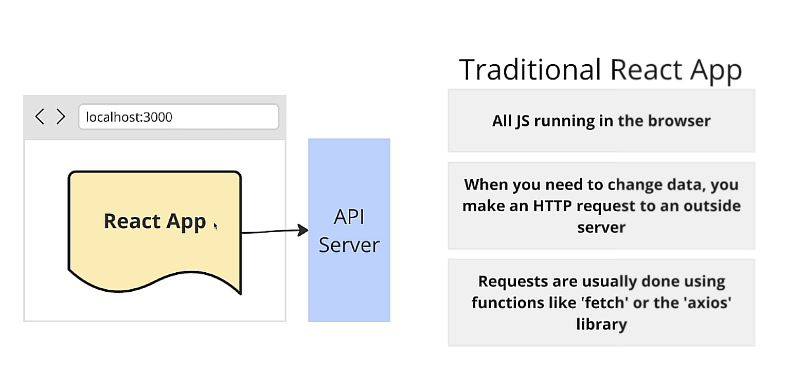

On Next.js applications, things are way different:
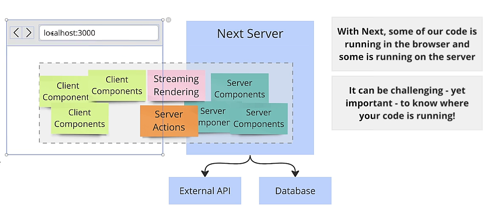

Taking this app as an example of what happens on the background and how next.js handle data:
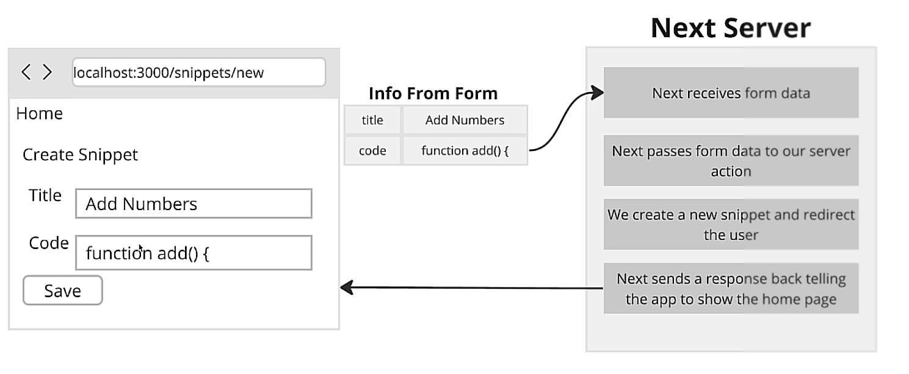

## Components (server and client)

### Server component

This kind of component bends rules of traditional components.

Using this, we can probably achieve better performance + UX!.

By default, all next.js components are `server sided`.

We can use async/await. Don´t need useState or useEffect to do `data fetching`.

Limitations:

- Can `not`use any king of hook
- Can `not` assign any event handlers

### Client component

Essentially the same kind of React components that are used on React applications.

All the usual rules of components.

Can use hooks, event handlers, etc.

On `Next.js`, to use a client component, we need to use a special string: `"use client"` on top of our component.

Limitations:

- Can `not` show a Server Component (except one case)

Recomendation on using a client component:

- You need to use hooks
- You need to use event handlers

Even though this kind of component tells us that is directly related to the client, when user makes a request to the 
server, client components do get rendered one time on the server, then html is formed and sent to the client as a 
server response.

## Special file names

On Next.js applications, we have some special file names reserved for special purposes.

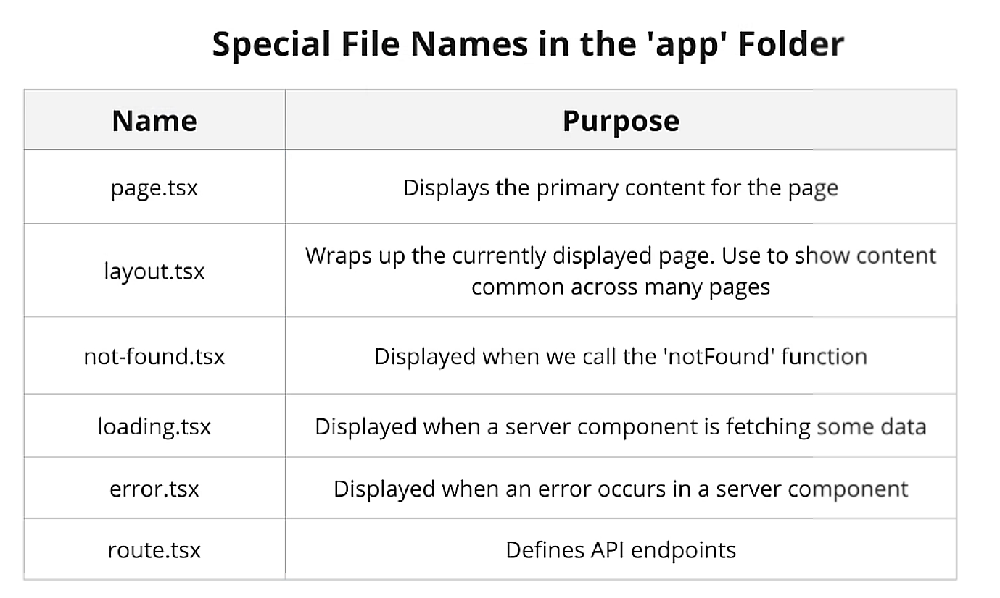

## Rendering a client component inside a server side component

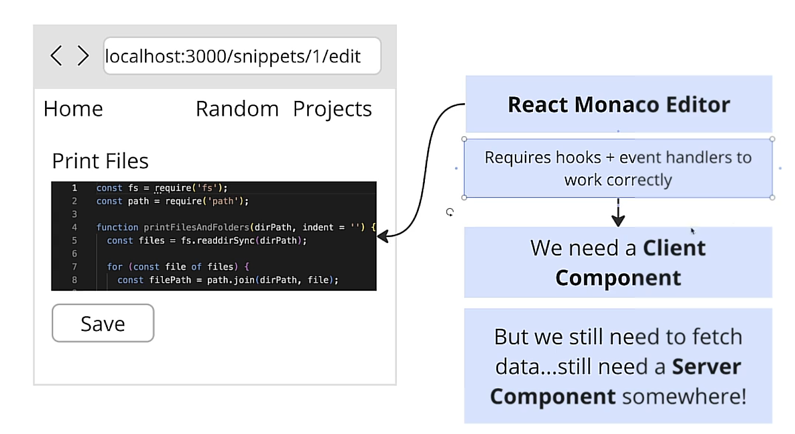

The solution for the edit page is as follows:

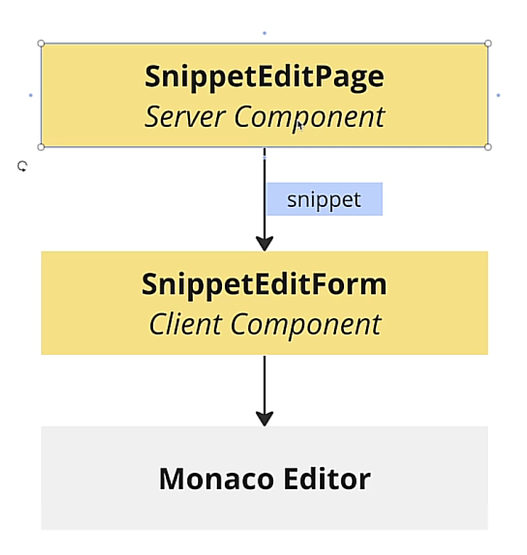

### Server action inside client components

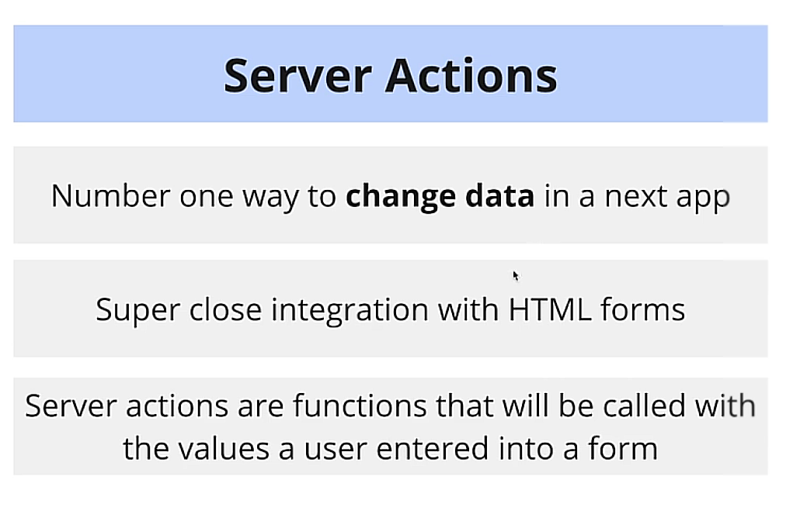

Ok, we already know how and why to use `server actions` on next applications, but here we get a major important
rule when working with client components:

`Server actions cannot be defined in client components`

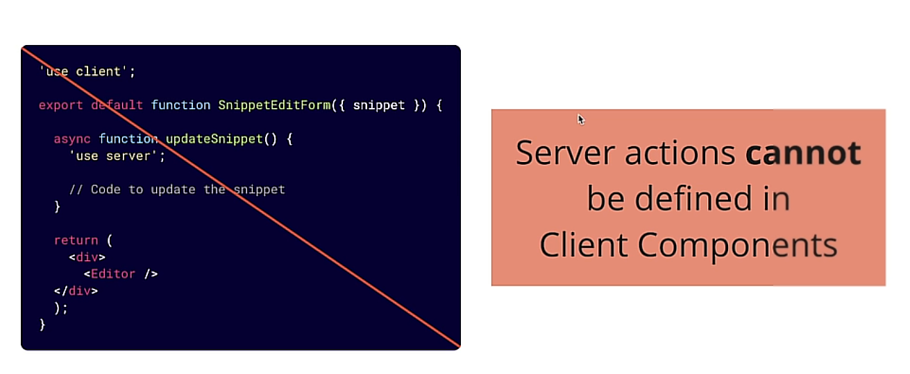

There are two ways to deal with this situation:

#### Passing a server action through props 

This way, the parent component, which must be a server component, passes through props the action. Pretty much like a 
normal react component behavior.

#### Exporting the action from a isolated file

Using this option, we have the bennefit of sharing this action through all our application, which is hosted on an 
isolated file.

This way we must use the string `"use server"` just one single time on the top of the file, and thats it.

### Using a server action 

There are many different ways to use a server action inside a client component. Very interesting solutions are:

#### Using bind of the action itself among componenet data (state...)

There is a huge benefit. Form will work even if the client can´t run javascript (big companies, government)

#### Using async await and event handlers

On this solution, we don´t have to worry about the bind function and it is closer to a react normal behavior.

## Handling errors

Now, there is a very very tricky way to handle form validation using server side components along with client side
components.

On this example, we've used a hook called `useFormstate` to implement a react in our client side from a validation that
occurs on the server side.

Basically, server actions `createSnippet` now receives two arguments: `formState` and `formData`. If this actions 
returns a message, than it will cause a re-render on our client side component, and formState get´s updated there.

### special file name error.tsx

There is a special file name that when included on a page folder, turns to be the preferred file to deal with error
for that page, due to it's location (closest to the page).

Error pages `must` be a client side component!!!

`important note: We do not want to put our next.js redirect function inside a try-catch block. This kind of function
works returning or trowing an error that is not actually an error. It is something that Next.js is waiting for.`

## Caching 

Here is a feature on next.js that needs to be understood correctly, because if not, it can make the application
go crazy or lead to unexpected behavior.

`important note: Caching is useful on production mode`

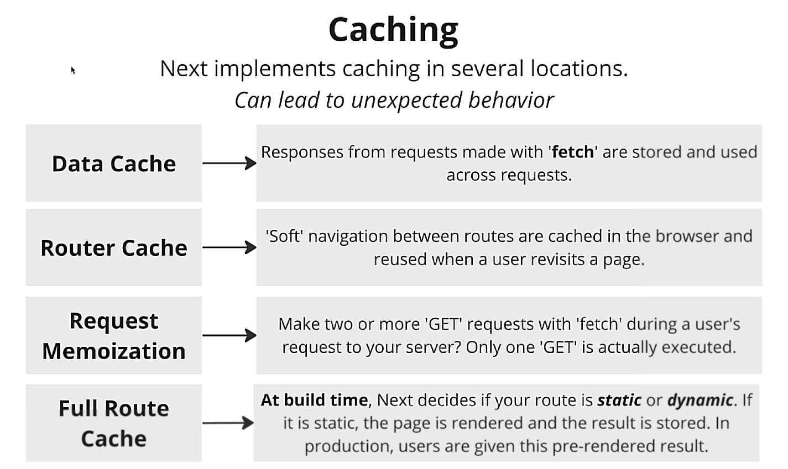

### Full route caching

This is where next can lead our aplication to unexpected behavior. Basically, when building on production mode,
next analyzes each existing route and classify it on `static` or `dynamic`.

#### static route

Means next thinks this content doesn´t change accross time, and so, it's caching system will make it render once.

#### dynamic route

Next will treat this as a route that changes a lot, and so, it will disable hard and aggressive caching system to make
data available.

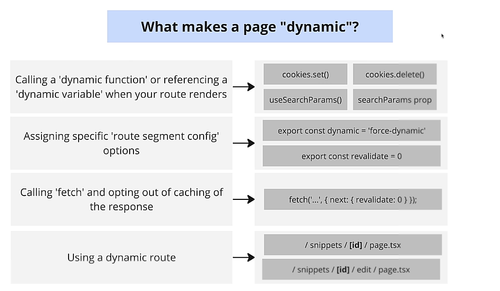

### Using caching control

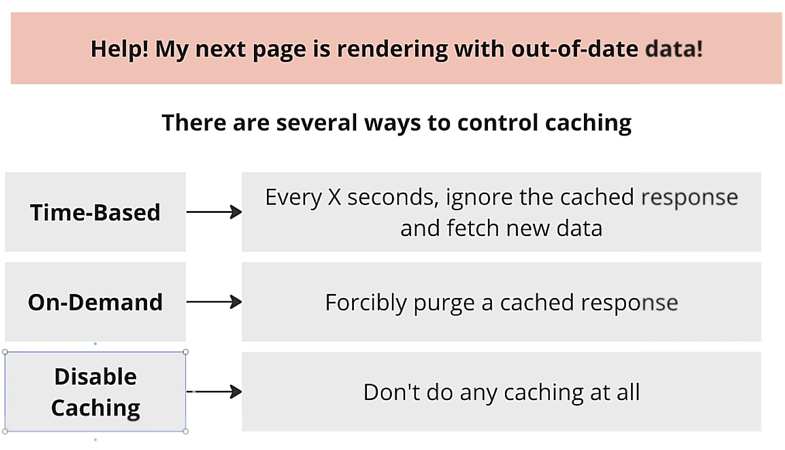

#### Time based

#### On-demand

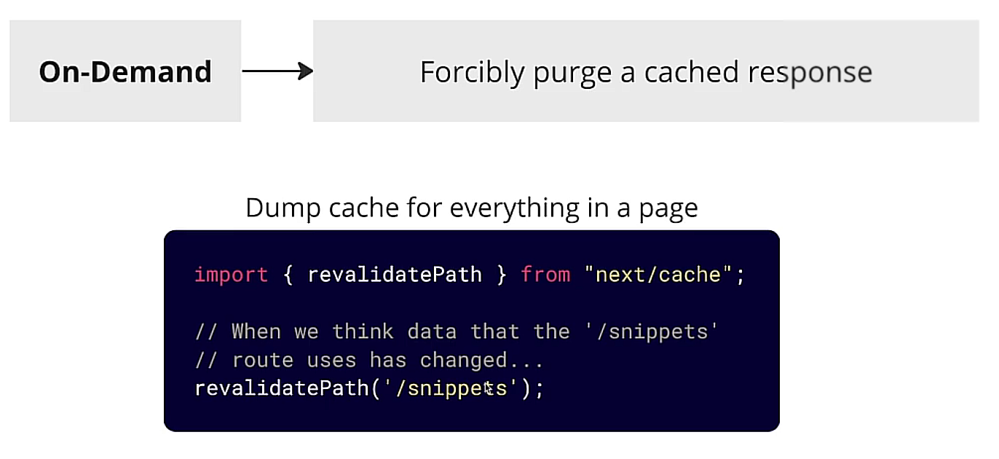

#### Cache disabled

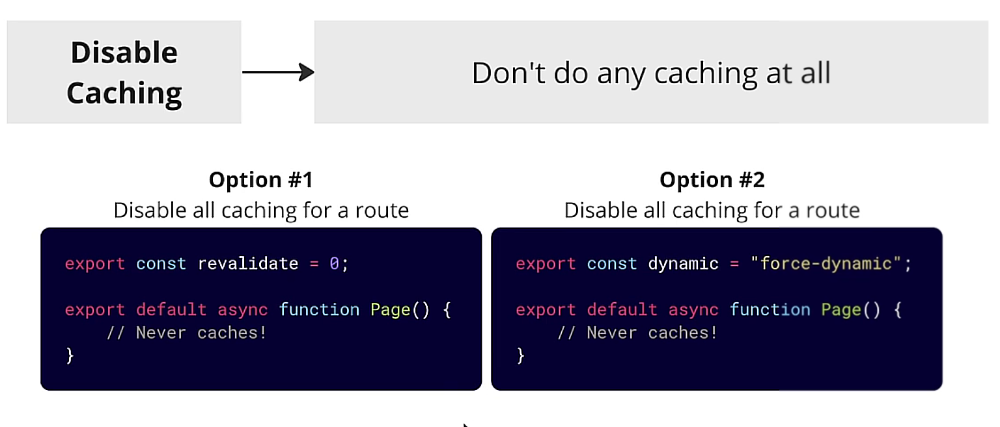

### GenerateStaticParams

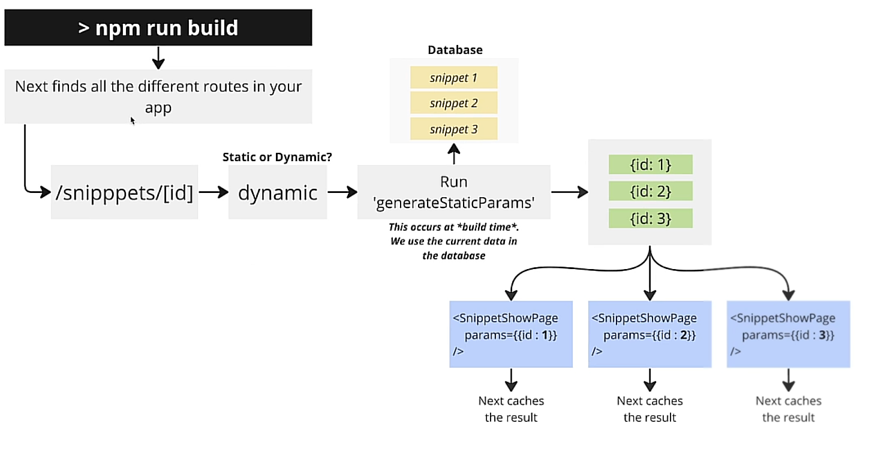

## Production Mode

That´s it, not get this thing tested and ready to prod! Here is where our applications comes to life and where 
caching really starts to shine and show performance with really amazingly fast updates.

build a prod version locally:

`npm run build`

Now, start a prod version locally:

`npm run start`

### Vercel and Next

Install vercel through npm globally

once configured, you simply goes to the directory of your front-end application, the one with .next file and run:

`vercel`

for production deployment on vercel:

`vercel --prod`